<div align="justify">

# METAL GEAR SOLID Wiki - Proyecto
> **Desarrollador:** Nabil L.A. ([ Nabil L.A. ([@nalleon](https://github.com/nalleon)) ](https://github.com/nalleon)) 

<br>

<div align="center">

</div>

## Índice
- [Metal Gear Solid Wiki - Proyecto](/code/mgs-project/)
  - [Anteproyecto](/draft-project/)
  - [Detalles del proyecto](#index01)
  - [Tecnologías utilizadas](#index02)
  - [Definición de la estructura del proyecto y BBDD](#index03)
  - [Endpoints de los servicios REST](#index04)
  - [Endpoints de los servicios SOAP](#index05)
  - [Cobertura de código](#index06)

</br>

## Detalles del proyecto 📦 <a name="index01"></a>

El objetivo principal de este proyecto es desarrollar una base de datos que almacene información relevante y detallada sobre la saga de videojuegos Metal Gear Solid. Esta wiki contendrá datos sobre personajes, juegos, directores, artistas y usuarios que interactúan con el sistema.

Para gestionar y consultar esta información, el proyecto incluirá tanto una API RESTful como servicios SOAP, permitiendo así una mayor flexibilidad en el acceso a los datos. Además, contará con una interfaz gráfica para la visualización intuitiva de los videojuegos y sus personajes.

La seguridad será una prioridad clave, por lo que se implementarán medidas de autenticación y autorización para restringir el acceso a los recursos de la API. Asimismo, se utilizarán bases de datos relacionales y no relacionales, optimizando el almacenamiento y la gestión de los diferentes tipos de datos según los escenarios de uso.

</br>

## Tecnologías utilizadas 🖥️ <a name="index02"></a>

Estas son las tecnologías que utilizaremos a lo largo del desarollor del proyecto:

- **IDE:**
  - [IntelliJ IDEA - Community Edition](https://www.jetbrains.com/idea/) para el desarrollo del código en Java.
  - [Visual Studio Code](https://code.visualstudio.com/) para la creación de documentación en Markdown y desarrollo adicional en JavaScript.

- **Gestión de Dependencias:**
  - [Maven](https://maven.apache.org/) para la gestión de dependencias y compilación del proyecto.

- **Bases de Datos y ORM:**
  - [MongoDB Atlas](https://www.mongodb.com/) como base de datos no relacional.
  - [SQLite](https://www.sqlite.org/index.html) como base de datos relacional.
  - [Hibernate/JPA](https://hibernate.org/) como ORM para la gestión de entidades relacionales.

- **Frameworks para la API:**
  - [Spring Boot](https://spring.io/projects/spring-boot) como framework principal para el desarrollo de la aplicación.
  - [Spring Data JPA](https://spring.io/projects/spring-data-jpa) para la interacción con bases de datos relacionales.
  - [Spring Data MongoDB](https://spring.io/projects/spring-data-mongodb) para la interacción con bases de datos MongoDB.
  - [Swagger](https://swagger.io/) para las pruebas de los endpoints de la API.
  - [SoapUI](https://www.soapui.org/) para las pruebas de los servicios SOAP.

- **Securización:**
  - [**Spring Security**](https://spring.io/projects/spring-security): como framework para la gestión de autenticación y autorización.
  - [**JSON Web Tokens (JWT)**](https://jwt.io/): para la creación y validación de tokens seguros para la autenticación de usuarios.
  - [**Spring Security Test**](https://docs.spring.io/spring-security/reference/testing/overview.html): para facilitar la creación de pruebas relacionadas con la seguridad.

- **Documentación:**
  - [Markdown](https://daringfireball.net/projects/markdown/) para la creación de documentos estructurados y legibles.
  - [Swagger UI](https://swagger.io/tools/swagger-ui/) como interfaz gráfica para la documentación de la API rest.
  - [SoapUI](https://www.soapui.org/) para la documentación de los servicios SOAP.

- **Despliegue:**
  - [Docker](https://www.docker.com/) para la creación de contenedores y despliegue del proyecto en diferentes entornos.


<div align="center">

</div>

</br>

## Definición de la estructura del proyecto y BBDD 💾 <a name="index03"></a>

A continuación, se presentan las relaciones entre las entidades del sistema y las acciones que los usuarios pueden realizar sobre ellas. Este diagrama refleja cómo los usuarios sin privilegios pueden interactuar con los datos almacenados en la base de datos, diferenciando entre los elementos gestionados en SQLite y MongoDB.

***

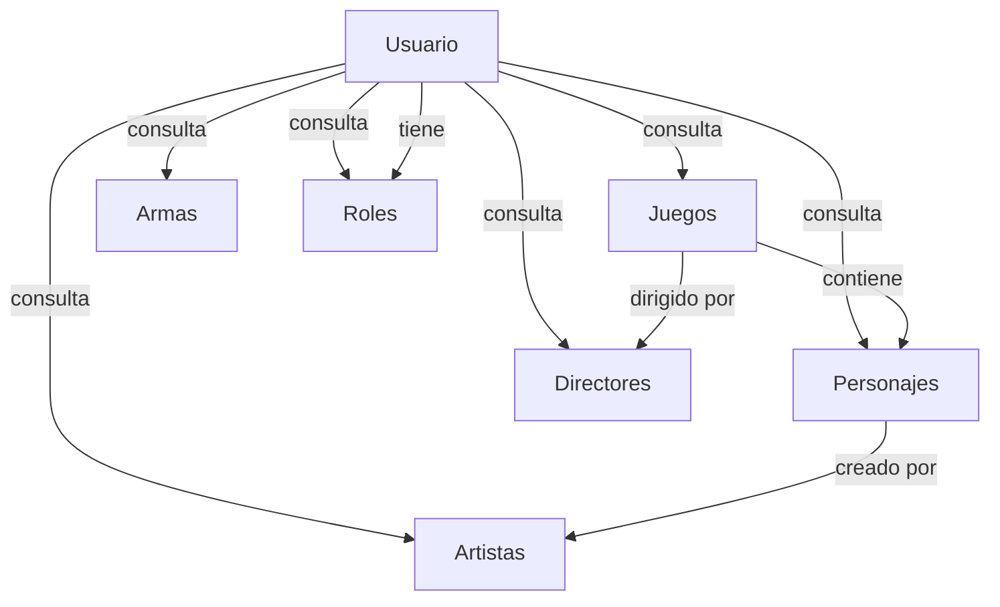

***

</br>

Seguidamente, vamos a analizar las acciones para usuarios con privilegios, cuyos casos de uso asociados siempre siguen el mismo conjunto de acciones básicas:

  - Consultar: Obtener información detallada de la entidad.
  - Crear: Registrar una nueva instancia de la entidad en el sistema.
  - Actualizar: Modificar los datos de una entidad existente.
  - Eliminar: Borrar una entidad del sistema.

</br>

### **Actor: Usuario con Privilegios** (Juegos)

|  Actor | Usuario con Privilegios |
|---|---|
| **Descripción**  | Usuario con permisos para gestionar información de los juegos en el sistema. |
| **Características**  | Puede crear, actualizar, eliminar y consultar juegos. |
| **Relaciones** | Gestión de juegos, Asociación con personajes y directores |
| **Notas** | Solo usuarios con privilegios pueden modificar los datos. |
| **Autor**  |  Nabil L.A. ([@nalleon](https://github.com/nalleon))  |
| **Fecha** | 2025-02-12 |

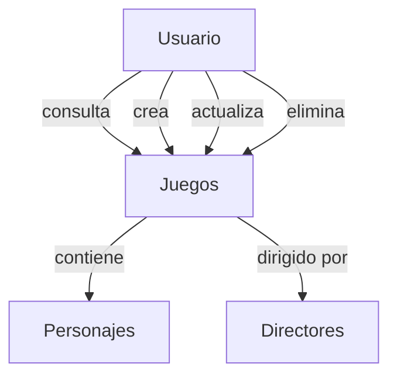

---

### **Actor: Usuario con Privilegios** (Personajes)

|  Actor | Usuario con Privilegios |
|---|---|
| **Descripción**  | Usuario con permisos para gestionar información de los personajes en el sistema. |
| **Características**  | Puede crear, actualizar, eliminar y consultar personajes. |
| **Relaciones** | Asociación con juegos y artistas |
| **Notas** | Solo usuarios con privilegios pueden modificar los datos. |
| **Autor**  |  Nabil L.A. ([@nalleon](https://github.com/nalleon))  |
| **Fecha** | 2025-02-12 |


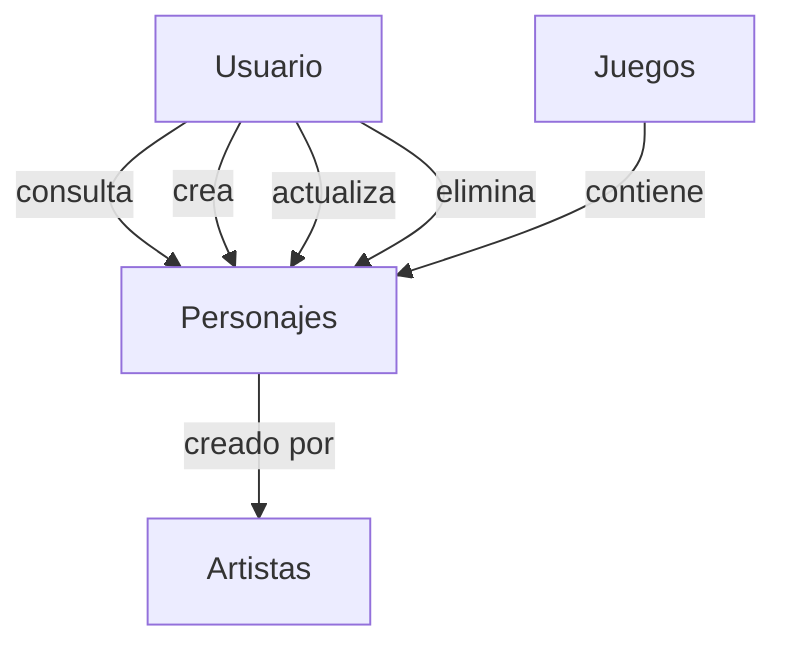

---


### **Actor: Usuario con Privilegios** (Directores)

|  Actor | Usuario con Privilegios |
|---|---|
| **Descripción**  | Usuario con permisos para gestionar información de los directores en el sistema. |
| **Características**  | Puede crear, actualizar, eliminar y consultar directores. |
| **Relaciones** | Asociación con juegos |
| **Notas** | Solo usuarios con privilegios pueden modificar los datos. |
| **Autor**  |  Nabil L.A. ([@nalleon](https://github.com/nalleon))  |
| **Fecha** | 2025-02-12 |


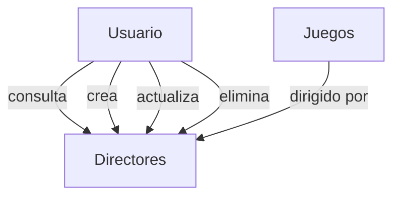

---

### **Actor: Usuario con Privilegios** (Artistas)

|  Actor | Usuario con Privilegios |
|---|---|
| **Descripción**  | Usuario con permisos para gestionar información de los artistas en el sistema. |
| **Características**  | Puede crear, actualizar, eliminar y consultar artistas. |
| **Relaciones** | Asociación con personajes |
| **Notas** | Solo usuarios con privilegios pueden modificar los datos. |
| **Autor**  |  Nabil L.A. ([@nalleon](https://github.com/nalleon))  |
| **Fecha** | 2025-02-12 |


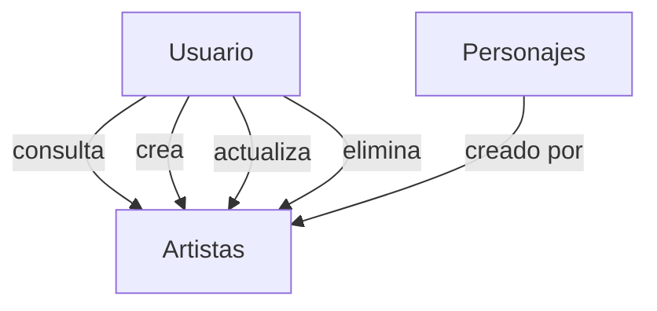

---

### **Actor: Usuario con Privilegios** (Armas)

|  Actor | Usuario con Privilegios |
|---|---|
| **Descripción**  | Usuario con permisos para gestionar información de las armas en el sistema. |
| **Características**  | Puede crear, actualizar, eliminar y consultar armas. |
| **Relaciones** | Independiente de otros módulos |
| **Notas** | Solo usuarios con privilegios pueden modificar los datos. |
| **Autor**  |  Nabil L.A. ([@nalleon](https://github.com/nalleon))  |
| **Fecha** | 2025-02-12 |

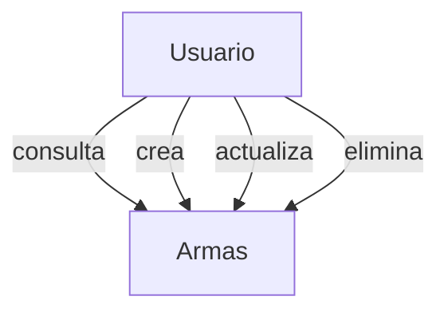

---

### **Actor: Usuario con Privilegios** (Roles)

|  Actor | Usuario con Privilegios |
|---|---|
| **Descripción**  | Usuario con permisos para gestionar información de los roles en el sistema. |
| **Características**  | Puede crear, actualizar, eliminar y consultar roles. |
| **Relaciones** | Asociación con usuarios |
| **Notas** | Solo usuarios con privilegios pueden modificar los datos. |
| **Autor**  |  Nabil L.A. ([@nalleon](https://github.com/nalleon))  |
| **Fecha** | 2025-02-12 |

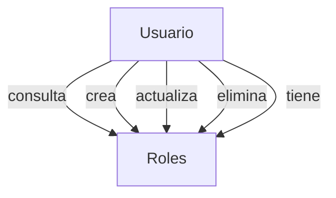

---


### **Actor: Usuario con Privilegios** (Usuarios)

|  Actor | Usuario con Privilegios |
|---|---|
| **Descripción**  | Usuario con permisos para gestionar información de los usuarios en el sistema. |
| **Características**  | Puede crear, actualizar, eliminar y consultar usuarios. |
| **Relaciones** | Asociación con roles |
| **Notas** | Solo usuarios con privilegios pueden modificar los datos. |
| **Autor**  |  Nabil L.A. ([@nalleon](https://github.com/nalleon))  |
| **Fecha** | 2025-02-12 |

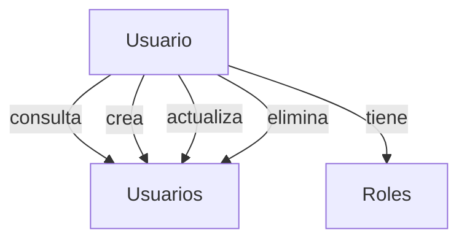

***

</br>

Tras esto, inicialmente esta ha sido la definición de las clases de manera progragmática para la implementación en base de datos relacional (SQLite) y no relacional (MongoDB).

<div align="center">
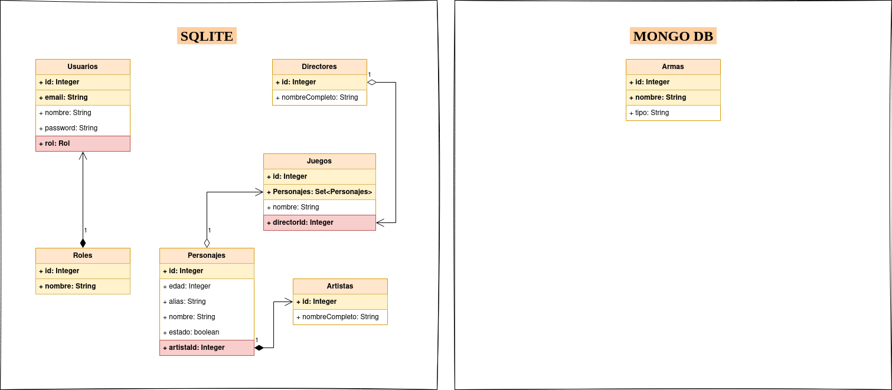
</div>

</br>

### Relaciones:

| Entidad 1    | Relación | Entidad 2    | Descripción            |
|--------------|----------|--------------|------------------------|
| **Juegos**   | N:M      | **Personajes** | Un juego puede tener múltiples personajes, y un personaje puede aparecer en múltiples juegos. |
| **Juegos**   | 1:N      | **Directores** | Un juego es dirigido por un único director, pero un director puede dirigir varios juegos. |
| **Personajes** | 1:N    | **Artistas**   | Un personaje es creado por un único artista, pero un artista puede crear varios personajes. |
| **Usuarios** | 1:N      | **Roles**      | Un usuario puede tener un único rol, pero un rol puede ser asignado a varios usuarios. |


***
</br>

## Endpoints de los servicios REST  <a name="index04"></a>

Toda la documentación de estos endpoints está disponible en Swagger en la siguiente URL: http://localhost:8080/swagger-ui/index.html. 

Para acceder a ella, simplemente compila y ejecuta el proyecto con el siguiente comando en la terminal:

```bash
mvn spring-boot:run
```

</br>

## Para usuarios sin autenticar 🔑
### Autenticación
- **GET** `/api/v1/auth/register` → Para crear un nuevo usuario.
- **GET** `/api/v1/auth/login` → Autenticarse con un usuario existente .

***
</br>

## Para usuarios autenticados 🔒
### Usuarios
- **GET** `/api/v2/users` → Obtiene todos los usuarios.
- **GET** `/api/v2/users/{id}` → Obtiene un usuario por su ID.

### Roles
- **GET** `/api/v2/roles` → Obtiene todos los roles.
- **GET** `/api/v2/roles/{id}` → Obtiene un rol por su ID.

### Juegos
- **GET** `/api/v2/games` → Obtiene todos los juegos.
- **GET** `/api/v2/games/{id}` → Obtiene un juego por su ID.


### Personajes
- **GET** `/api/v2/characters` → Obtiene todos los personajes.
- **GET** `/api/v2/characters/{id}` → Obtiene un personaje por su ID.

### Armas
- **GET** `/api/v2/weapons` → Obtiene todas las armas.
- **GET** `/api/v2/weapons/{id}` → Obtiene un arma por su ID.


### Artistas
- **GET** `/api/v2/artists` → Obtiene todos los artistas.
- **GET** `/api/v2/artists/{id}` → Obtiene un artista por su ID.


### Directores
- **GET** `/api/v2/directors` → Obtiene todos los directores.
- **GET** `/api/v2/directors/{id}` → Obtiene un director por su ID.

***
</br>

## Para administradores 🔐
### Usuarios
- **GET** `/api/v3/users` → Obtiene todos los usuarios.
- **GET** `/api/v3/users/{id}` → Obtiene un usuario por su ID.
- **POST** `/api/v3/users` → Crea un nuevo usuario.
- **DELETE** `/api/v3/users/{id}` → Elimina un usuario por su ID.

### Roles
- **GET** `/api/v3/roles` → Obtiene todos los roles.
- **GET** `/api/v3/roles/{id}` → Obtiene un rol por su ID.
- **POST** `/api/v3/roles` → Crea un nuevo rol.
- **DELETE** `/api/v3/roles/{id}` → Elimina un rol por su ID.

### Juegos
- **GET** `/api/v3/games` → Obtiene todos los juegos.
- **GET** `/api/v3/games/{id}` → Obtiene un juego por su ID.
- **POST** `/api/v3/games` → Crea un nuevo juego.
- **DELETE** `/api/v3/games/{id}` → Elimina un juego por su ID.

### Personajes
- **GET** `/api/v3/characters` → Obtiene todos los personajes.
- **GET** `/api/v3/characters/{id}` → Obtiene un personaje por su ID.
- **POST** `/api/v3/characters` → Crea un nuevo personaje.
- **DELETE** `/api/v3/characters/{id}` → Elimina un personaje por su ID.

### Armas
- **GET** `/api/v3/weapons` → Obtiene todas las armas.
- **GET** `/api/v3/weapons/{id}` → Obtiene un arma por su ID.
- **POST** `/api/v3/weapons` → Crea una nueva arma.
- **DELETE** `/api/v3/weapons/{id}` → Elimina un arma por su ID.

### Artistas
- **GET** `/api/v3/artists` → Obtiene todos los artistas.
- **GET** `/api/v3/artists/{id}` → Obtiene un artista por su ID.
- **POST** `/api/v3/artists` → Crea un nuevo artista.
- **DELETE** `/api/v3/artists/{id}` → Elimina un artista por su ID.

### Directores
- **GET** `/api/v3/directors` → Obtiene todos los directores.
- **GET** `/api/v3/directors/{id}` → Obtiene un director por su ID.
- **POST** `/api/v3/directors` → Crea un nuevo director.
- **DELETE** `/api/v3/directors/{id}` → Elimina un director por su ID.


***


</br>

## Endpoints de los servicios SOAP <a name="index05"></a>

La documentación completa de los servicios SOAP puede consultarse a través de sus respectivos WSDLs, como por ejemplo puede ser: `{http://impl.soap.service.project.mgs.puerto.ies.es/}MGSCharacterServiceSoapService` para los personajes.

Para acceder a ella, simplemente compila y ejecuta el proyecto con el siguiente comando en la terminal:

```bash
mvn spring-boot:run
```

</br>

- Ejemplo de petición SOAP (getById) a traves de [SoapUI](https://www.soapui.org/downloads/soapui/):

A la izquierda podemos ver la estructura de la solicitud, mientras que a la derecha apreciamos el resultado de esta una vez transmitida.

<div align="center">
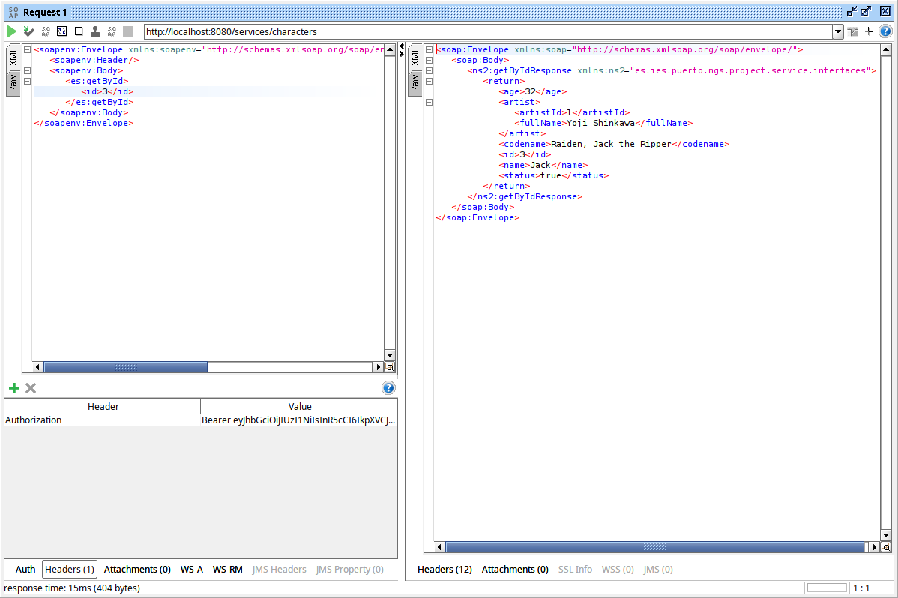
</div>


</br>

## Para administradores 🔐
### Usuarios
- **Endpoint:** `http://localhost:8080/services/users`
- **WSDL:** `{http://impl.soap.service.project.mgs.puerto.ies.es/}UserServiceSoapService`
- **Operaciones:**
  - `add`
  - `update`
  - `getAll`
  - `delete`
  - `getById`

### Roles
- **Endpoint:** `http://localhost:8080/services/roles`
- **WSDL:** `{http://impl.soap.service.project.mgs.puerto.ies.es/}RoleServiceSoapService`
- **Operaciones:**
  - `add`
  - `update`
  - `getAll`
  - `delete`
  - `getById`

### Juegos
- **Endpoint:** `http://localhost:8080/services/games`
- **WSDL:** `{http://impl.soap.service.project.mgs.puerto.ies.es/}GameServiceSoapService`
- **Operaciones:**
  - `add`
  - `update`
  - `getAll`
  - `delete`
  - `getById`


### Personajes
- **Endpoint:** `http://localhost:8080/services/characters`
- **WSDL:** `{http://impl.soap.service.project.mgs.puerto.ies.es/}MGSCharacterServiceSoapService`
- **Operaciones:**
  - `add`
  - `update`
  - `getAll`
  - `delete`
  - `getById`


### Armas
- **Endpoint:** `http://localhost:8080/services/weapons`
- **WSDL:** `{http://impl.soap.service.project.mgs.puerto.ies.es/}WeaponServiceSoapService`
- **Operaciones:**
  - `add`
  - `update`
  - `getAll`
  - `delete`
  - `getById`


### Directores
- **Endpoint:** `http://localhost:8080/services/directors`
- **WSDL:** `{http://impl.soap.service.project.mgs.puerto.ies.es/}DirectorServiceSoapService`
- **Operaciones:**
  - `add`
  - `update`
  - `getAll`
  - `delete`
  - `getById`


### Artistas
- **Endpoint:** `http://localhost:8080/services/artists`
- **WSDL:** `{http://impl.soap.service.project.mgs.puerto.ies.es/}ArtistServiceSoapService`
- **Operaciones:**
  - `add`
  - `update`
  - `getAll`
  - `delete`
  - `getById`

***

<br>

## Cobertura de código 🛡️  <a name="index06"></a>

Con un total actual de 285 tests esta es la cobertura del proyecto: 90%

<div align="center">
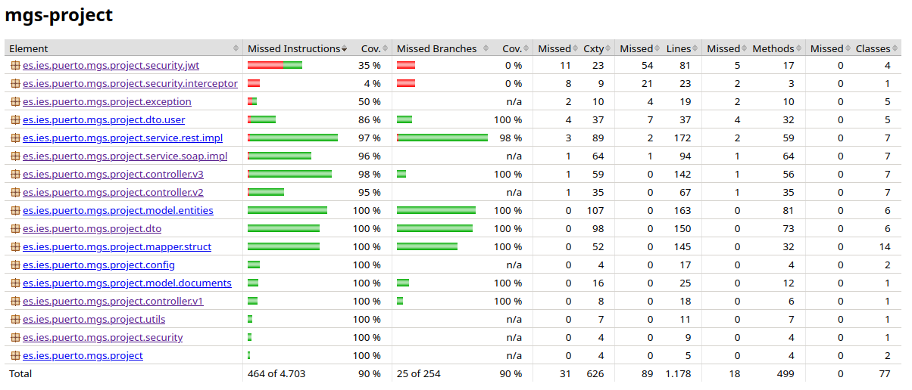
</div>
